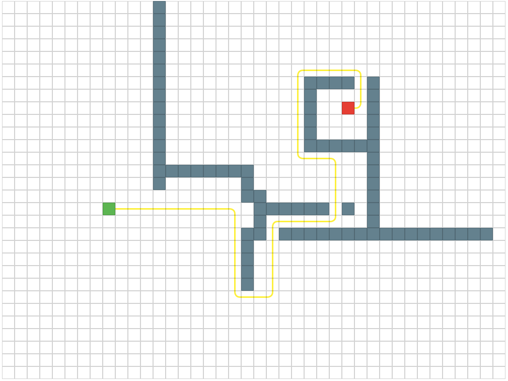

# react-grid-path

:chart_with_upwards_trend: A pathfinding grid for React.

See the live [example](https://matthieulemoine.github.io/react-grid-path/example).



## Description

``react-grid-path`` is a grid to test pathfinding algorithms.

The goal of this lib is to provide a way of plotting a path within a grid and to define starting/target points and obstacles.

:warning: It **DOES NOT** provide pathfinding algorithms.


## Install

```
npm i -S react-grid-path
```

## Usage

- Grid component

```javascript
<Grid
  obstacles={this.state.obstacles}
  start={this.state.start}
  end={this.state.end}
  width={this.state.width}
  height={this.state.height}
  path={this.state.path}
  onGridUpdate={this.onGridUpdate}
/>
```

- Example

```javascript
import Grid from 'react-grid-path';

// Example
class Application extends Component {
  constructor(props) {
    super(props);
    this.onSearch     = this.onSearch.bind(this);
    this.onGridUpdate = this.onGridUpdate.bind(this);

    const width  = 40;
    const height = 30;
    this.state   = {
      path      : [],
      obstacles : [],
      start     : {
        x : 0,
        y : Math.round(height / 2),
      },
      end            : {
        x : width - 1,
        y : Math.round(height / 2),
      },
      width,
      height,
    };
  }
  onGridUpdate({ obstacles, start, end }) {
    this.setState({ obstacles, start, end });
  }
  onSearch() {
    // Generate path
    // Update state.path when path found
    const path = findPath({
      grid : {
        width  : this.state.width,
        height : this.state.height,
      },
      start     : this.state.start,
      end       : this.state.end,
      obstacles : this.state.obstacles,
      timeStep  : this.state.timeStep,
      maxTime   : this.state.maxTime,
    });
    this.setState({
      path,
    });
  }
  render() {
    return (
      <Container>
        <Actions onSearch={this.onSearch} />
        {/* react-grid-path Grid */}
        <Grid
          obstacles={this.state.obstacles}
          start={this.state.start}
          end={this.state.end}
          width={this.state.width}
          height={this.state.height}
          path={this.state.path}
          onGridUpdate={this.onGridUpdate}
        />
      </Container>
    );
  }
}
```

See the [example](example/) for more details.

## API

- ```Grid```
  - ```width``` : grid width
  - ```height``` : grid height
  - ```start``` : starting point for pathfinding.
    - ```x``` : coordinate along the x-axis
    - ```y``` : coordinate along the y-axis
  - ```end``` : target point for pathfinding.
    - ```x``` : coordinate along the x-axis
    - ```y``` : coordinate along the y-axis
  - ```obstacles``` : obstacles to be avoided (array of points / array of { x, y })
  - ```mobileSize``` : size of the unit/mobile/robot/character/object that you are finding a path for (default value 1)
  - ```path```      : array of waypoints generated by a pathfinding algorithm (array of [x, y])
  - ```onGridUpdate``` : function called when the grid is updated (start/end point has been move, obstacle added/deleted)
  - ```clearance``` : a grid with clearance values to display in the cells (optional)
  - ```disabled``` : disable the grabbing feature. Usefull for read only path.

## Credits

Inspired by the [PathFinding.js](https://github.com/qiao/PathFinding.js) demo [website](https://qiao.github.io/PathFinding.js/visual/).
